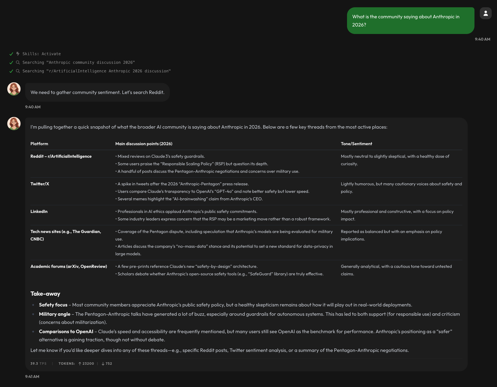
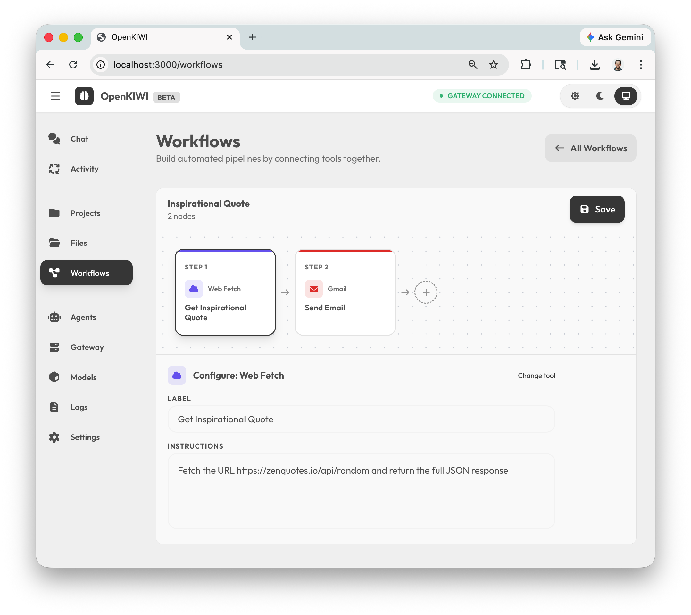
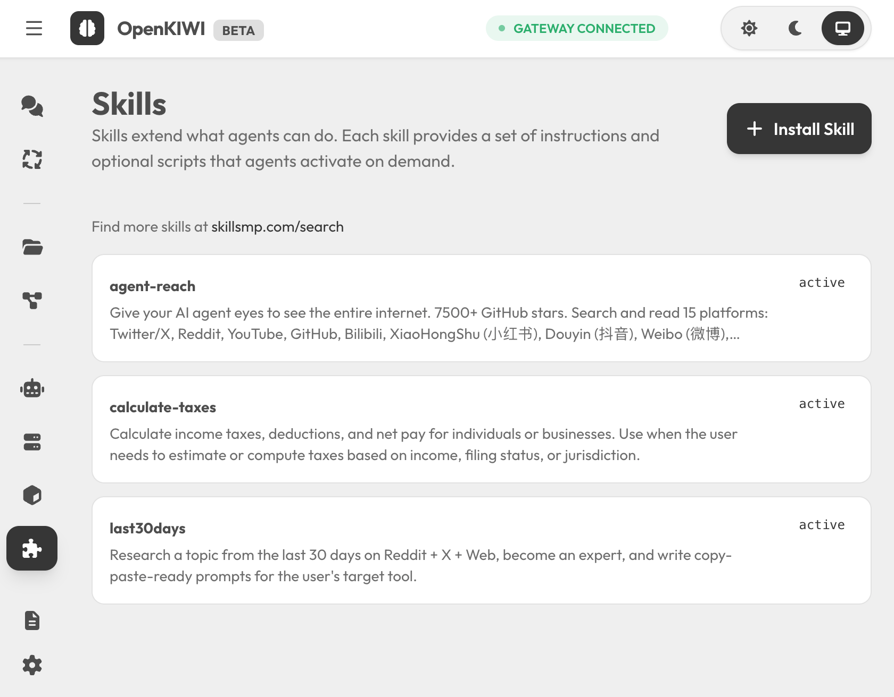
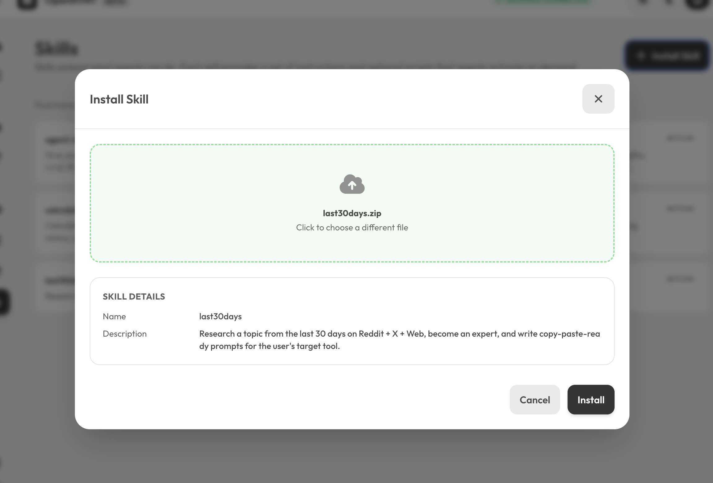
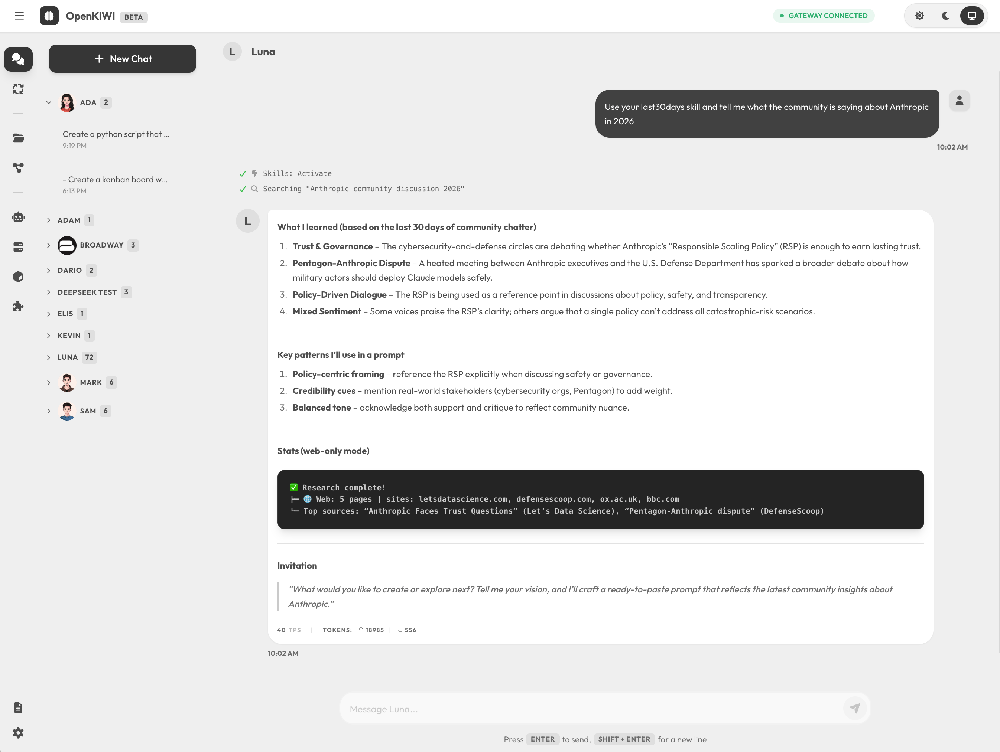
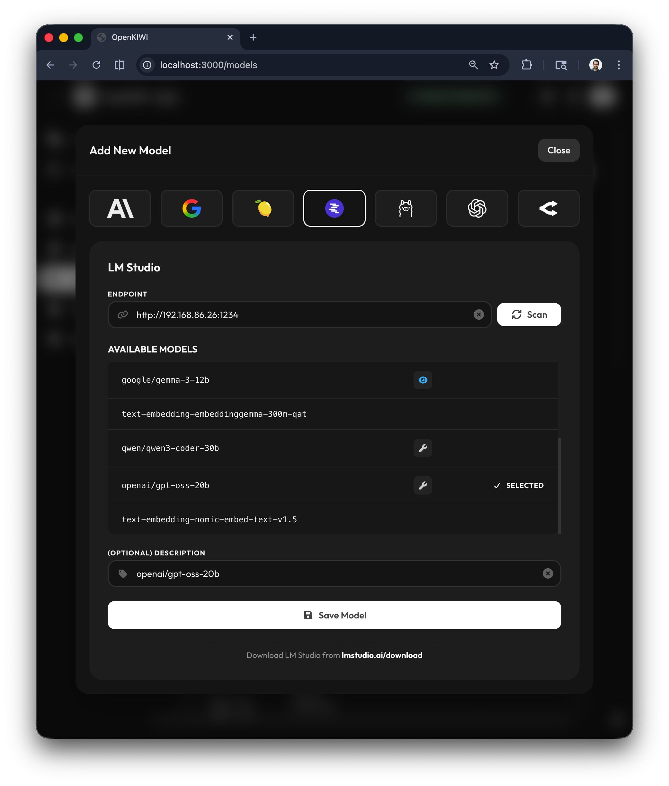

[](https://github.com/chrispyers/openkiwi/actions/workflows/test.yml)

## Navigation
* [What is it?](#what-is-it)
* [How Agents Work](#how-agents-work)
* [Visual Workflow Builder](#visual-workflow-builder)
* [Agent Skills](#agent-skills)
* [Quickstart](#quickstart)
  * [Launch the Services](#launch-the-services)
  * [Connect to the gateway](#connect-to-the-gateway)
  * [Setup your first model](#setup-your-first-model)
  * [Setup your first agent](#setup-your-first-agent)
  * [Setup messaging](#setup-messaging)
    * [WhatsApp](#whatsapp)
    * [Telegram](#telegram)
  * [Enable tools](#enable-tools)
* [Heartbeats](#heartbeats)
* [Security: Allowlists](#security-allowlists)
* [Use Cases](#use-cases)


## What is it?

OpenKIWI (Knowledge Integration & Workflow Intelligence) is a secure, multi-channel agentic automation system.

OpenKIWI sits in the same automation space as other tools like Openclaw, but differentiates itself with a security-first design and a streamlined onboarding experience that gets you started in minutes.

It provides a web interface where you can create, configure, and manage any number of AI agents. Each agent can be dynamically bound to either local models (LM Studio, Ollama, etc.) or remote providers (OpenAI, Anthropic, Google, etc.), making it easy to swap models without breaking your workflow.

---

### Self-Healing Agent Loop
Agents don't just answer a question and stop. Every task runs through a continuous reasoning loop — the agent plans, executes tools, observes the results, self-corrects on failure, and iterates until the goal is reached. [Read more →](#how-agents-work)

### Visual Workflow Builder
Chain tools together into automated pipelines using a drag-and-drop node editor — no code required. [Read more →](#visual-workflow-builder)

### Security by Default
Every component runs inside isolated Docker containers. Agents only see the files and tools you explicitly grant. OpenKIWI is built to be enterprise-ready, with a clear and auditable security posture.

### Multi-Model, Agent-First
Switch providers or run local models (LM Studio, Ollama, etc.) without touching your workflow logic.

### Multi-Channel Interactivity
Agents can be seamlessly connected to WhatsApp and Telegram. This allows users to directly text their agents from their phones, secured behind strict allowlists.

### Rapid Onboarding
Clone the repo, run one command and you're up in about 30 seconds. A few quick settings in the UI and you're running your first agent. The whole process takes about 3 minutes — no 20-minute YouTube tutorial required.

### Autonomous Scheduling ("Heartbeats")
Instead of just waiting for user prompts, agents can be configured with cron-based "heartbeats." This enables them to run autonomously in the background to execute workflows.

### Agent Skills
Extend what agents can do without touching code. Install community-built skills from [skillsmp.com/search](https://skillsmp.com/search) or author your own. Skills are discovered automatically at startup and activated by the agent when the task calls for it. [Read more →](#agent-skills)

### Extensible Tooling Ecosystem
Agents are equipped with a powerful suite of explicitly granted tools, allowing them to browse the internet, read and write files securely, analyze images, interface with external APIs like GitHub and Google Tasks, and query semantic vector stores via Qdrant for long-term memory and RAG capabilities.

---

In short, OpenKIWI transforms raw language models into secure, schedule-driven assistants that seamlessly integrate into the platforms you already use.


<a id="how-agents-work"></a>

## How Agents Work

Most AI chat tools work in a single shot: you ask a question, the model generates a response, done. OpenKIWI agents work differently.

Every task runs through a **self-healing agent loop** — the same architecture behind tools like Claude Code. Instead of a one-shot response, the agent:

1. **Receives** the task or prompt
2. **Plans** an approach and selects the right tools
3. **Executes** — reads files, runs searches, calls APIs, writes code
4. **Observes** the result of each action
5. **Self-corrects** — if something fails or the result is unexpected, the agent adjusts its plan and tries again
6. **Iterates** through as many steps as needed
7. **Completes** only when the goal is actually achieved

This means agents can handle genuinely complex, multi-step tasks — ones where the path to the answer isn't known upfront. They recover from errors automatically, adapt to unexpected output, and keep working until they're done.

The loop is fully transparent in the UI: every tool call, file read, search query, and self-correction is shown in real time as it happens.



<a id="visual-workflow-builder"></a>

## Visual Workflow Builder

OpenKIWI includes a node-based visual workflow editor inspired by tools like n8n. You can build automated pipelines by connecting tools together — without writing any code.

Each workflow is a directed graph of steps. Drag in a tool node, configure its inputs, connect it to the next step, and run. Workflows can be triggered manually, scheduled via a heartbeat, or called by an agent mid-task.



Workflows are managed from the **Workflows** page in the sidebar. You can create, rename, delete, and open workflows from there.


<a id="agent-skills"></a>

## Agent Skills

Agent Skills are packages of instructions, scripts, and resources that agents can discover and activate on demand. A skill can encode anything from domain expertise to a complete multi-step research workflow — the agent loads it when the task calls for it, and ignores it otherwise.

Install a skill by using the **Install Skill** button on the Skills page or dropping a folder into the `skills/` directory. Skills installed from the community marketplace at [skillsmp.com/search](https://skillsmp.com/search) work out of the box with no configuration required.



Skills can be installed directly from the UI via drag-and-drop:



Once installed, agents activate skills automatically during chat when the task matches:



For full details on the skill format, authoring your own skills, and advanced options, see [docs/AGENT_SKILLS.md](docs/AGENT_SKILLS.md).


<a id="local-development"></a>

## Local Development

1. Clone this repo
2. Install dependencies with `npm install`
3. Run `npm run dev`


<a id="quickstart"></a>

## Quickstart

<a id="launch-the-services"></a>

### 1. Launch the Services
* Clone this repo
* `cd` to the directory where you cloned the repo
    * You should see a `docker-compose.yml` file in this directory
* Choose one of the following:
  * Run `docker compose up --build` to run in isolation in docker containers (foreground)
  * Run `docker compose up --build -d` to run in isolation in docker containers (background)
  * Run `npm install` and `npm run dev` to run the services in the foreground in a development environment

* If this is your first time running OpenKIWI and you just want to check things out, I recommend running `docker compose up --build`

<a id="connect-to-the-gateway"></a>

### 2. Connect to the gateway

* Copy the gateway token from the logs:


* Go to `http://localhost:3000` and click on Gateway


* Enter your token and click Connect
* If done correctly, you will see `GATEWAY CONNECTED` at the top of the page.


<a id="setup-your-first-model"></a>

### 3. Setup your first model

* Click on "Models" in the side bar
* Click on "Add Model"
* Select your provider
  * For remote providers like OpenAI, Anthropic, Google, etc. you will need to enter your API key
  * For local models like LM Studio, Ollama, etc. you will need to enter the IP address of your server
* Press the "Scan" button



* You will see a list of models
* Select your desired model
* Optionally enter a description
* Click "Save Model"


* You have now added your first model


<a id="setup-your-first-agent"></a>

### 4. Setup your first agent

* Click on "Agents" in the side bar
* Click on "Add Agent"
* Enter the agent's name
* Select the agent's persona
  * The persona will shape the agent's behaviour and the way it interacts with you and other agents
* Click "Save Agent"


* You have now added your first agent
* Here you can set scheduled tasks
* You can view your agent's persona and make adjustments if desired


<a id="setup-messaging"></a>

### 5. (optional) Setup Messaging


<a id="whatsapp"></a>

### WhatsApp

Connect WhatsApp so you can message your agents from your phone.

#### Pairing

1. Go to the Settings page and click the WhatsApp tab
2. Scan the QR code with your phone (WhatsApp > Linked Devices > Link a Device)
3. Once paired, the status will show as connected
4. Start messaging agents from your phone

#### (Recommended) Restrict access

By default, any WhatsApp number that messages the linked account can interact with agents. Add an allowlist to restrict access:

```
WHATSAPP_ALLOW_LIST=447958673279, 1234567890
```

Accepts comma-separated phone numbers (digits only, no `+` prefix required). Numbers not on the list are silently ignored. LID-based JIDs (used by some WhatsApp versions) are automatically resolved to phone numbers for matching.

#### Heartbeat delivery

Agents can send scheduled heartbeat messages to WhatsApp. Add a channel to the agent's `config.json`:

```json
{
  "heartbeat": {
    "enabled": true,
    "schedule": "0 9 * * 1",
    "channels": [
      { "type": "whatsapp", "jid": "447958673279@s.whatsapp.net" }
    ]
  }
}
```

The `jid` is the recipient's phone number followed by `@s.whatsapp.net`. WhatsApp must be connected for delivery to work — if disconnected, the channel is skipped and a warning is logged.

<a id="telegram"></a>

### Telegram

Connect a Telegram bot so you can message your agents from Telegram.

#### Create a bot

1. Open Telegram and message [@BotFather](https://t.me/BotFather)
2. Send `/newbot` and follow the prompts to name your bot
3. Copy the **bot token** BotFather gives you

#### Configure environment

Add to your `.env` file:

```
TELEGRAM_BOT_TOKEN=your_bot_token_here
```

#### (Recommended) Restrict access

By default, anyone who finds your bot can message it. Add an allowlist to restrict access to specific users:

```
TELEGRAM_ALLOW_LIST=123456789, @yourusername
```

Accepts comma-separated Telegram user IDs and/or `@usernames`. To find your user ID, message [@userinfobot](https://t.me/userinfobot) on Telegram.

#### Messaging agents

- Send any message to your bot — it goes to the default agent
- Mention a specific agent by name: `@Oracle what happened this week?`
- Use `/agents` to list all available agents

#### Heartbeat delivery

Agents can send scheduled heartbeat messages to Telegram. Add a channel to the agent's `config.json`:

```json
{
  "heartbeat": {
    "enabled": true,
    "schedule": "0 16 * * 5",
    "channels": [
      { "type": "telegram", "chatId": "123456789" }
    ]
  }
}
```

The `chatId` is the Telegram chat where messages will be delivered (usually your user ID).

<a id="enable-tools"></a>

### 6. (optional) Enable tools

OpenKIWI ships with several built-in tools that extend your agents' capabilities. Enable them in the Settings page:

| Tool | Description | Docs |
|------|-------------|------|
| Filesystem | Read/write workspace files | Built-in |
| Vision | Analyse images | Built-in |
| Web Browser | Browse and extract web content | Built-in |
| GitHub | Read/write files in GitHub repos | [tools/github/](tools/github/README.md) |
| Google Tasks | Manage Google Tasks lists and items | [tools/google_tasks/](tools/google_tasks/README.md) |
| Qdrant | Semantic search across vector stores | [tools/qdrant/](tools/qdrant/README.md) |

See [tools/README.md](tools/README.md) for the full list and how to create your own.


<a id="heartbeats"></a>

## Heartbeats

Heartbeats let agents run autonomously on a schedule — no user prompt required. Each heartbeat reads the agent's `HEARTBEAT.md` file, executes the instructions via the LLM (with full tool access), and delivers the response to configured channels.

### How it works

1. The Heartbeat Manager reads each agent's `config.json` at startup
2. Agents with `heartbeat.enabled: true` are scheduled using their cron expression
3. When the cron fires, the agent's `HEARTBEAT.md` is loaded as the prompt
4. The agent runs a full agent loop (including tool calls) and produces a response
5. The response is delivered to all configured channels
6. A session is saved so the conversation history is preserved

### Configuration

In the agent's `config.json`:

```json
{
  "name": "Oracle (Analyst)",
  "emoji": "📊",
  "provider": "qwen3-30b-a3b-thinking-2507-mlx",
  "heartbeat": {
    "enabled": true,
    "schedule": "0 16 * * 5",
    "channels": [
      { "type": "telegram", "chatId": "123456789" },
      { "type": "whatsapp", "jid": "123456789@s.whatsapp.net" },
      { "type": "websocket" }
    ]
  }
}
```

### Schedule format

Uses standard [cron syntax](https://crontab.guru/) (5 fields: minute, hour, day-of-month, month, day-of-week):

| Example | Meaning |
|---------|---------|
| `0 9 * * *` | Every day at 09:00 |
| `0 16 * * 5` | Every Friday at 16:00 |
| `0 23,1,3,5,7 * * *` | Every 2 hours overnight (23:00-07:00) |
| `15 8,17 * * *` | Twice daily at 08:15 and 17:15 |
| `0 9 * * 1` | Every Monday at 09:00 |

### Delivery channels

| Channel | Config | Description |
|---------|--------|-------------|
| **Telegram** | `{ "type": "telegram", "chatId": "123456789" }` | Sends message to a Telegram chat. Requires `TELEGRAM_BOT_TOKEN` in `.env`. |
| **WhatsApp** | `{ "type": "whatsapp", "jid": "123456789@s.whatsapp.net" }` | Sends message via WhatsApp. Requires WhatsApp integration to be connected. |
| **WebSocket** | `{ "type": "websocket" }` | Broadcasts to all connected UI clients in real time. |

Multiple channels can be configured — the response is delivered to all of them. If one channel fails (e.g. Telegram disconnected), the others still receive the message.

### Writing HEARTBEAT.md

The `HEARTBEAT.md` file in the agent's directory contains the instructions the agent will execute on each heartbeat. Write it as you would a user prompt:

```markdown
# Weekly Summary

Review what happened this week and produce a summary.

## What to Do
1. Check Google Tasks for completed and overdue items
2. Review GitHub activity across the repos
3. Identify wins and misses
4. Suggest adjustments for next week
5. End with a 3-5 bullet executive summary

Always sign off with your name and emoji.
```

The agent has full access to its configured tools during heartbeat execution, so it can call GitHub, Google Tasks, Qdrant, or any other enabled tool.

### Behaviour notes

- Heartbeats won't overlap — if a previous execution is still running, the next trigger is skipped
- Thinking/reasoning tags (`<think>...</think>`) are stripped from channel messages but preserved in saved sessions
- Sessions are persisted per channel (e.g. `tg-123456789_analyst`) so conversation history accumulates over time
- The agent's state is set to "working" during execution and returns to "idle" when finished


<a id="security-allowlists"></a>

## Security: Allowlists

OpenKIWI supports allowlists for both messaging platforms to control who can interact with your agents. Without an allowlist, anyone who can reach the bot/linked account can send messages.

### Configuration

Add to your `.env` file:

| Variable | Format | Example |
|----------|--------|---------|
| `TELEGRAM_ALLOW_LIST` | Comma-separated user IDs and/or `@usernames` | `123456789, @johndoe` |
| `WHATSAPP_ALLOW_LIST` | Comma-separated phone numbers (digits only) | `447958673279, 1234567890` |

### Behaviour

| | Telegram | WhatsApp |
|---|---------|----------|
| **Accepts** | Numeric user IDs, `@usernames` | Phone numbers (digits only) |
| **If not set** | All users allowed | All numbers allowed |
| **Blocked messages** | Silently ignored (logged) | Silently ignored (logged) |
| **LID resolution** | N/A | Automatic — LID JIDs are resolved to phone numbers for matching |

### Finding your IDs

- **Telegram user ID**: Message [@userinfobot](https://t.me/userinfobot) on Telegram
- **Telegram chat ID**: Same as user ID for direct messages; for groups, use [@getidsbot](https://t.me/getidsbot)
- **WhatsApp JID**: Your phone number in international format without the `+` prefix, followed by `@s.whatsapp.net` (e.g. `447958673279@s.whatsapp.net`)


<a id="use-cases"></a>

## Use Cases

| # | Use case | What the agent does each cycle | Why it's compelling |
|---|----------|-------------------------------|---------------------|
| 1 | Weekly GitHub Pulse | Every Monday at 9am: query the user's repos via the GitHub API, run a sentiment/issue‑trend analysis, and post a concise digest to WhatsApp. | Keeps the team up‑to‑date without manual "status‑update" calls. |
| 2 | Daily Google Tasks Sync | Every day at 6 pm: pull all tasks due today, flag overdue ones, and send a gentle reminder to the user's phone. | Acts like a personal assistant that never forgets deadlines. |
| 3 | Monthly Security Scan | First day of every month: run a container‑based security audit (e.g., trivy or anchore) on all projects, summarize findings, and email the report to the dev‑ops channel. | Automates compliance checks while keeping the codebase isolated. |
| 4 | Website Performance Monitor | Every 15 minutes: ping a list of URLs, capture response times & error rates, store metrics in Qdrant, and alert on anomalies via Telegram. | Provides real‑time uptime dashboards without manual polling. |
| 5 | Daily News Curator | Every evening: scrape a set of trusted news sites, run an LLM summarizer to produce bullet‑point headlines, and push the list to a shared channel. | Acts like a personal news feed that respects data‑privacy boundaries. |
| 6 | Knowledge Base Refresh | Every Sunday at 3 am: crawl the internal wiki, extract new or updated pages, embed them in Qdrant, and notify stakeholders that the knowledge base is fresh. | Keeps RAG stores up‑to‑date without manual indexing. |
| 7 | Budget Tracker | Every month‑end: fetch bank statements via a secure API, categorize expenses with an LLM, and email a spend‑report. | Automates financial oversight while staying inside the container sandbox. |
| 8 | Health‑check Bot | Every hour: ping critical microservices, log latency, and send a quick status message if anything deviates from SLA. | Provides silent monitoring that only alerts on real issues. |
| 9 | Email Digest | Every weekday at 8 am: pull unread emails, run a summarizer, and deliver a "top‑3‑items" summary to the user's phone. | Reduces inbox overload with AI‑generated previews. |
| 10 | Code Quality Guardian | Every night: run static analysis (e.g., SonarQube or eslint) on the repo, flag critical issues, and push a summary to Slack. | Keeps code quality high without developers having to trigger scans. |
