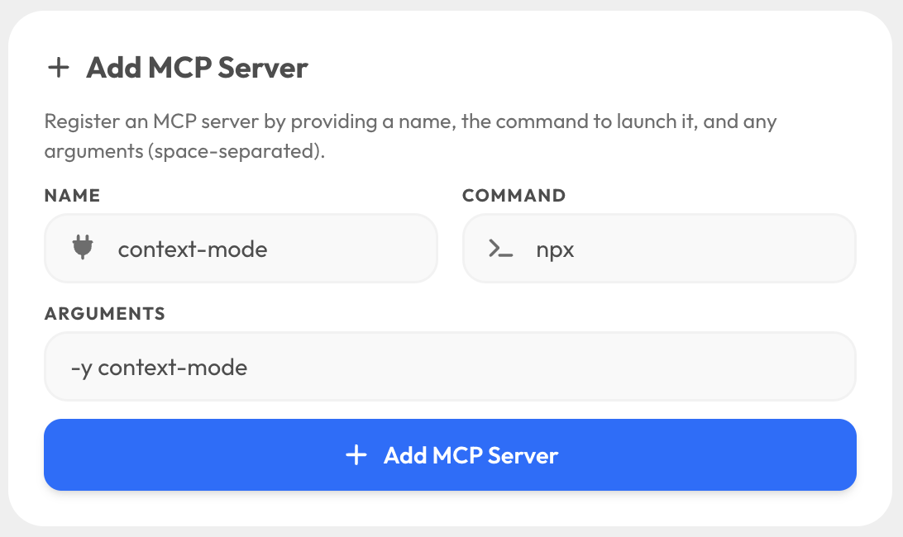
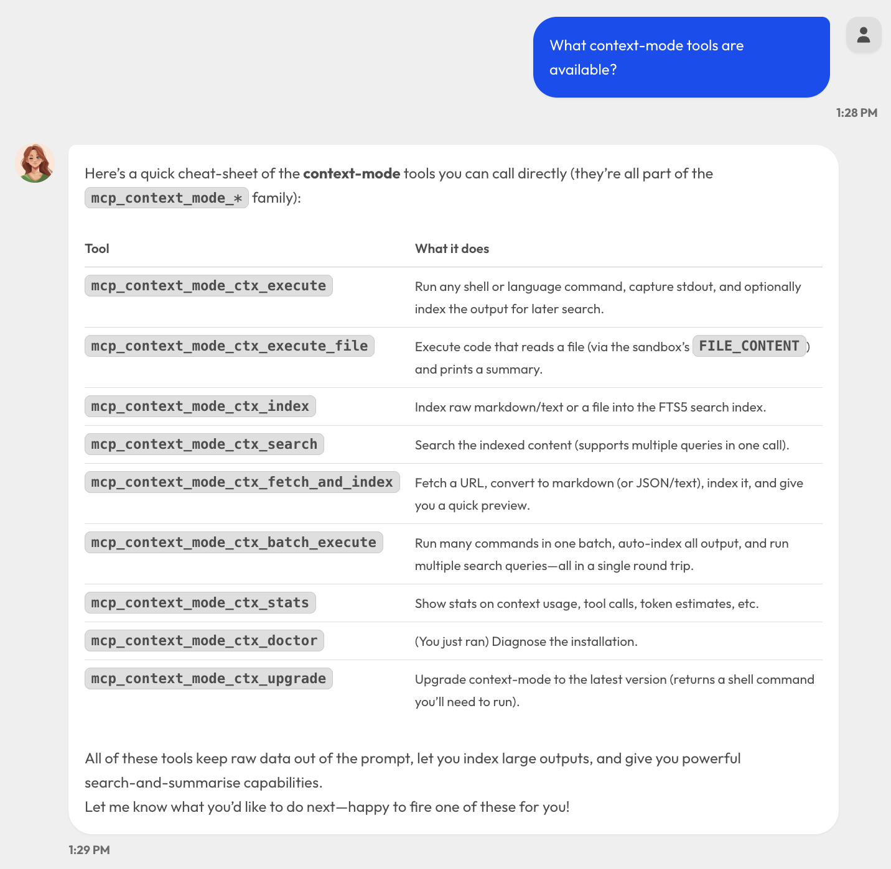
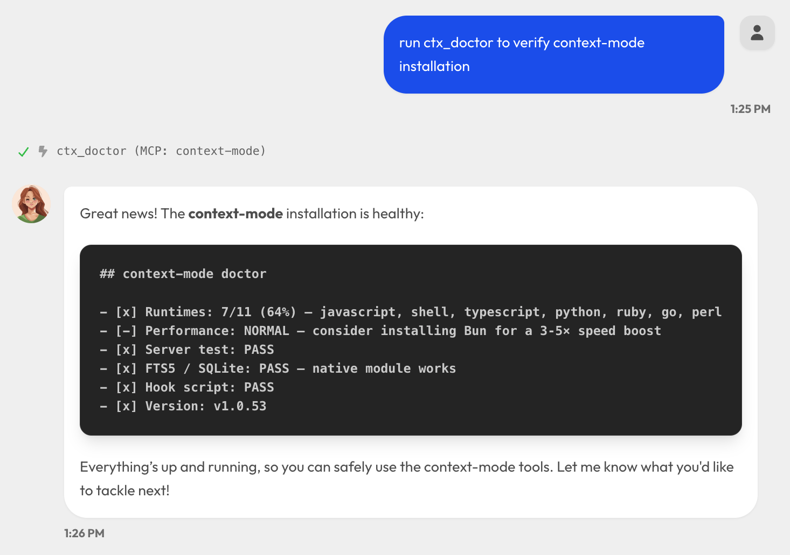
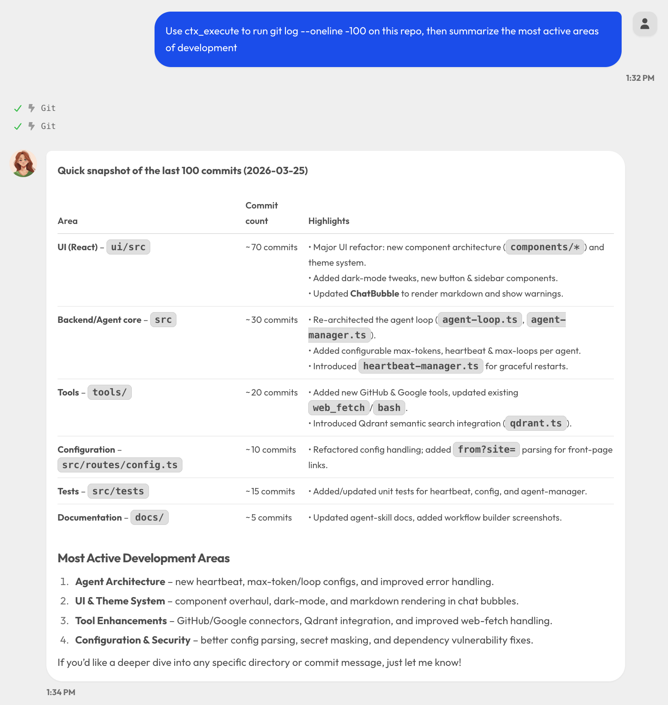
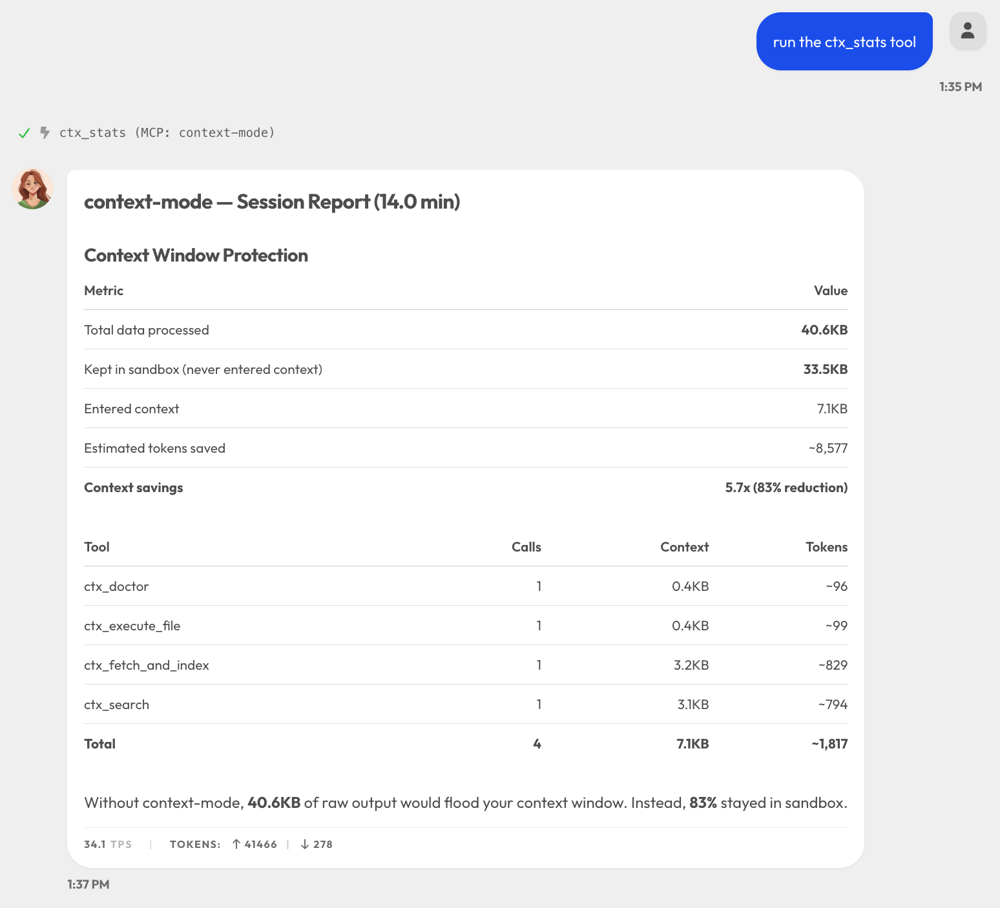

# Context Mode MCP Server

Context Mode is a privacy-first MCP server that keeps raw tool output out of the agent's context window. Web pages, API responses, file analysis, log files — everything is processed in a sandboxed subprocess. Only compact summaries enter the conversation. Raw data never leaves your machine.

- **No telemetry, no cloud sync, no account required**
- SQLite-based knowledge base with FTS5 full-text search
- 11 language runtimes (JS, TS, Python, Shell, Ruby, Go, Rust, PHP, Perl, R, Elixir)
- BM25 ranking with fuzzy correction and proximity reranking

GitHub: https://github.com/mksglu/context-mode
npm: https://www.npmjs.com/package/context-mode

---

## Installation

Context Mode is distributed as an npm package. No global install is required — OpenKIWI launches it on demand via `npx`.

### Prerequisites

- Node.js 18+
- npm (comes with Node.js)

### Verify the package is accessible

```bash
npx -y context-mode --help
```

---

## Setting Up in OpenKIWI

### Option 1: Via the UI (MCP Servers Page)

1. Navigate to **Settings > MCP Servers**
2. Click **Add Server**
3. Fill in the fields:
   - **Name:** `context-mode`
   - **Command:** `npx`
   - **Arguments:** `-y context-mode`
4. Click **Save**
5. Click **Reconnect All**

<!-- Screenshot: MCP Servers page with context-mode added -->


### Option 2: Direct Config Edit

Add the following to `config/config.json` under the `mcpServers` key:

```json
"mcpServers": {
  "context-mode": {
    "command": "npx",
    "args": ["-y", "context-mode"]
  }
}
```

Then restart the server or click **Reconnect All** in the UI.

### Verifying the Connection

After connecting, the MCP Servers page should show `context-mode` with status **connected** and **9 tools** discovered:

| Tool | Purpose |
|------|---------|
| `ctx_batch_execute` | Run multiple commands + searches in one call |
| `ctx_execute` | Run code in 11 languages, only stdout enters context |
| `ctx_execute_file` | Process files in sandbox, raw content never leaves |
| `ctx_index` | Chunk markdown into FTS5 with BM25 ranking |
| `ctx_search` | Query indexed content with multiple queries |
| `ctx_fetch_and_index` | Fetch URL, detect content type, chunk and index |
| `ctx_stats` | Show context savings and session statistics |
| `ctx_doctor` | Diagnose installation (runtimes, FTS5, versions) |
| `ctx_upgrade` | Upgrade to latest version from GitHub |

In OpenKIWI, these tools are registered with the prefix `mcp_context-mode_`, e.g. `mcp_context-mode_ctx_execute`.

<!-- Screenshot: MCP Servers page showing connected status and discovered tools -->


---

## Testing

### 1. Run Diagnostics

Send this message to the agent:

> Run ctx_doctor to check the context-mode installation

The agent should call `mcp_context-mode_ctx_doctor` and return a report showing runtime checks, FTS5 status, and version info.

<!-- Screenshot: ctx_doctor output in chat -->


### 2. Web Fetch and Index

> Use ctx_fetch_and_index to fetch https://news.ycombinator.com and summarize the top 10 stories

This fetches the page in the sandbox, converts HTML to markdown, chunks and indexes it — the raw page never enters context. Then the agent searches the indexed content to answer.

<!-- Screenshot: fetch and index example in chat -->


### 3. Shell Command Execution

> Use ctx_execute to run `git log --oneline -50` on this repo and summarize the most active areas

Instead of dumping 50 lines of git log into context, the sandbox captures stdout and returns a compact summary.

<!-- Screenshot: ctx_execute shell command example -->


### 4. Batch Operations

> Use ctx_batch_execute to: count TypeScript files, count total lines of code, and find all TODO comments

Runs multiple commands in a single call. Raw output stays in the sandbox.

<!-- Screenshot: batch execution example -->


### 5. Knowledge Base Indexing and Search

> Use ctx_fetch_and_index to fetch the Express.js getting started docs, then use ctx_search to find the middleware setup pattern

Two-step pattern: index content first, then query it with BM25-ranked search.

<!-- Screenshot: index then search example -->


### 6. Check Context Savings

After running a few of the above tests:

> Run ctx_stats to show context savings

Returns a per-tool breakdown of tokens consumed vs. tokens saved.

<!-- Screenshot: ctx_stats output showing savings -->


---

## How It Works in OpenKIWI

### What You Get

- **Sandbox tools** — All 6 sandbox tools work fully. Commands, file processing, web fetching, and knowledge base operations run in isolated subprocesses.
- **Context savings** — Raw data stays out of the context window. Typical savings are 94-99% depending on the operation.
- **Knowledge base** — FTS5 full-text search with BM25 ranking, porter stemming, trigram matching, and fuzzy correction.

### Limitations (No Hook Support)

OpenKIWI does not currently have a hook system like Claude Code. This means:

- **No automatic routing** — The agent won't automatically route bash/fetch calls through context-mode. You need to explicitly ask it to use `ctx_execute` or `ctx_fetch_and_index`, or add routing guidance to the system prompt.
- **No session continuity** — The PreCompact/SessionStart hooks that rebuild state after context compaction are not available. Session tracking data is not captured or restored.
- **~60% savings vs ~98%** — Without hooks enforcing routing, some tool calls will bypass the sandbox. With explicit prompting, savings are still significant.

### Improving Routing (Optional)

To encourage the agent to use context-mode tools by default, you can add routing instructions to the global system prompt in **Settings > Config**:

```
When executing shell commands, prefer ctx_execute over bash to keep raw output out of context.
When fetching web pages or APIs, prefer ctx_fetch_and_index to index content for efficient retrieval.
When processing large files, prefer ctx_execute_file to keep raw content in the sandbox.
```

---

## Benchmarks (from context-mode docs)

| Scenario | Raw Size | Context Size | Saved |
|----------|----------|-------------|-------|
| Playwright snapshot | 56.2 KB | 299 B | 99% |
| GitHub Issues (20) | 58.9 KB | 1.1 KB | 98% |
| Access log (500 requests) | 45.1 KB | 155 B | 100% |
| Analytics CSV (500 rows) | 85.5 KB | 222 B | 100% |
| Git log (153 commits) | 11.6 KB | 107 B | 99% |
| Test output (30 suites) | 6.0 KB | 337 B | 95% |
| Repo research (subagent) | 986 KB | 62 KB | 94% |

---

## Troubleshooting

| Problem | Solution |
|---------|----------|
| Status shows **disconnected** | Check that Node.js 18+ is installed. Run `npx -y context-mode --help` in a terminal to verify. |
| No tools discovered | The MCP handshake may have timed out. Click **Reconnect All**. Check server logs for stderr output. |
| ctx_doctor shows failures | Follow the diagnostic output — it identifies missing runtimes, FTS5 issues, and version mismatches. |
| Agent ignores context-mode tools | Add routing instructions to the system prompt (see "Improving Routing" above). |
| Slow first startup | The first `npx` invocation downloads the package. Subsequent starts are cached. |
